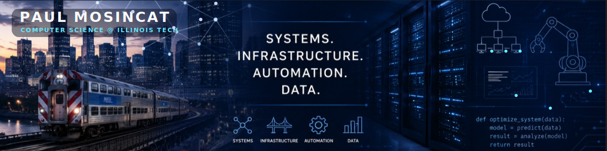

---

## About Me

I'm **Paul Mosincat**, a Computer Science student at **Illinois Institute of Technology** with a minor in **Circuits & Systems** and a specialization in **Information & Knowledge Management Systems**.

My main focus is building practical experience across **systems, infrastructure, automation, and data**. I am especially interested in networking, infrastructure, automation, IoT systems, enterprise technologies, data-driven solutions, and real-world technical systems that connect hardware, software, and operations.

---

## Education

**Illinois Institute of Technology**  
**B.S. Computer Science**  
Minor: **Circuits & Systems**  
Specialization: **Information & Knowledge Management Systems**  
Expected Graduation: **Spring 2028**

---

## Technical Skills

### Programming

### Web

### Systems & Infrastructure

### Technologies

### Areas of Interest

`Infrastructure Engineering` | `Network Engineering` | `Industrial Automation` | `IoT Systems` | `Systems Administration` | `Enterprise Technologies` | `Data-Driven Systems`

---

## Featured Projects

### Enterprise Hard Drive Barcode Scanner

Python-based barcode and OCR inventory system using **OpenCV**, **Tesseract OCR**, and **SQLite** to automate enterprise hard drive identification and inventory tracking.

**Focus areas:** computer vision, OCR, inventory automation, structured data storage

### Smart IoT Research Project

Hands-on project involving server organization, hardware inventory, barcode scanning, iterative testing, and infrastructure documentation.

**Focus areas:** IoT systems, infrastructure organization, documentation, hardware workflows

### Assembly Tetris

Low-level programming project implementing Tetris using assembly language concepts.

**Focus areas:** assembly programming, memory-level thinking, game logic, low-level systems

### RISC-V Mastermind Game

Console-based Mastermind game developed in **RISC-V assembly** using **RARS**. Implemented random code generation with digits 1-6 and no repeats, input validation, and a full game loop with black/white feedback logic.

**Associated with:** Illinois Institute of Technology  
**Timeline:** Mar 2026 - Apr 2026  
**Focus areas:** RISC-V assembly, low-level control flow, register management, debugging

### FPGA Digital System Design

Series of FPGA-based digital system design labs using **VHDL** and the **Vivado Design Suite**. Designed and implemented multiple systems including a code converter, ripple-carry adder/subtractor, and a traffic light controller.

Worked with FPGA hardware, breadboarding, and seven-segment displays to test and verify functionality, with emphasis on debugging, simulation, and translating logic designs into programmable hardware.

**Associated with:** Illinois Institute of Technology  
**Timeline:** Nov 2025 - Dec 2025  
**Focus areas:** VHDL, FPGA systems, digital design, finite state machines, hardware implementation

### Data Sorter

Java-based data sorting and order management system that processes and organizes structured input files. The project applies object-oriented programming principles including inheritance, polymorphism, and custom exception handling to manage different order types.

**Associated with:** Illinois Institute of Technology  
**Timeline:** Jan 2025 - May 2025  
**Focus areas:** Java, data processing, object-oriented design, file input handling, modular software design

### Urban Transit Systems Analysis

Course-based research project analyzing global transit systems in London, Singapore, Tokyo, and Chicago. Explored how technology, government policy, and system design influence transit performance, efficiency, and modernization.

Compared approaches such as AI-driven systems, biomimicry-based planning, and traditional infrastructure while connecting technical systems to real-world public outcomes.

**Associated with:** Illinois Institute of Technology  
**Timeline:** Mar 2025 - May 2025  
**Focus areas:** systems analysis, infrastructure research, analytical writing, transit modernization

---

## Certifications & Training

- **Schneider Electric Technical Training:** Electrical Fundamentals & Power Systems, Industrial Automation, DC & Networking, Energy Efficiency
- **AWS Cloud Foundations**
- **Drupal CMS Certification**

---

## Current Focus

- Cisco Networking Academy
- React.js
- Python development
- Cloud Security
- SCADA fundamentals
- Infrastructure automation

---

## Contact / Links

---

**Building practical systems through iteration, documentation, and hands-on engineering.**

